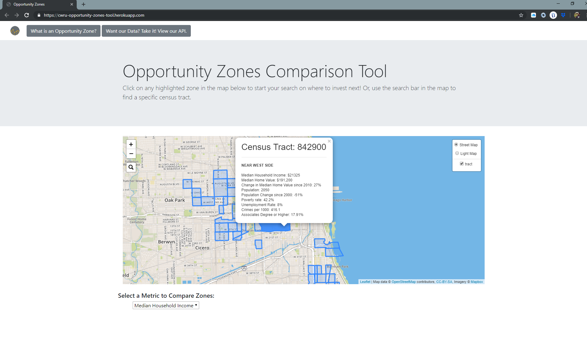

# Opportunity Zones Investment Tool

## Go here for the full app: https://cwru-opportunity-zones-tool.herokuapp.com/

The Opportunity Zones incentive is a new community investment program established by Congress in the Tax Cuts and Jobs Act of 2017 to encourage long-term investments in low-income urban and rural communities nationwide by providing tax benefits to investors.

## Our Goal and Boundaries

1. Provide investors with decision-making tools to make informed decisions about what Opportunity Zones to invest in within a given area

2. Investors could be anyone that wants to buy real estate or invest in local business in these zones

3. It will also provide local governments and Chambers of Commerce with a tool that is more user-friendly and dynamic,  versus requiring investors to sift through pages of information

4. We chose Cook County in Chicago as a proof of concept

5. 135 qualified Opportunity Zones exist in this County

## Our App - Click on any Zone for Key Metrics

## Compare all Zones Across all Key Metrics

## Easily Search for a Zone Using Census Tract Number

## The Tool Finds Your Desired Zone!

